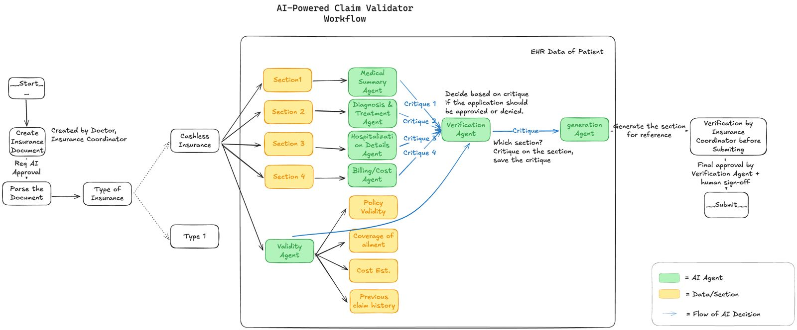

# MedAudit - Secure Medical Records Management System

## Project Overview

MedAudit is an AI-powered Electronic Health Records (EHR) management system designed to optimize hospital operations, improve patient experience, and reduce insurance claim rejections. Built during a 36-hour healthcare AI/ML hackathon conducted by OnMySite HealthCare at Parul University, MedAudit combines advanced AI multi-agent workflows with NFC-enabled seamless patient interactions to transform healthcare delivery.

## Problem Statement

Hospitals frequently face delays and financial losses due to incomplete or mismatched documentation during insurance claim processing. Patients experience frustration due to manual rework, long OPD registration times, and poor transparency in claim status.

## Key Features

* **AI-Powered Multi-Agent Workflow:** Automated insurance claim verification across multiple document sections (diagnosis, treatment, billing, policy match).
* **Secure EHR Management:** Patients’ medical records are stored securely with strict access control.
* **Role-Based Access Control:** Distinct views and permissions for Admins, Doctors, and Patients.
* **NFC Card Integration:** Patients use NFC cards to tap and securely share their medical data during OPD check-ins and emergency situations.
* **Emergency Access:** Critical health information (name, blood group, emergency documents) accessible via NFC tap during emergencies.
* **QR Code Support:** QR codes emulate NFC functionality for devices without NFC capability.
* **Cloudinary Storage:** Secure storage for medical documents and reports.
* **AI-Driven Reflexive Processing:** The system improves document validation accuracy through self-reflective learning loops.

## Multi-Agent Flow


The system uses a LangGraph-based orchestration of AI agents:

* **Section Agents:** Validate individual sections of medical and insurance documents.
* **Validity Agent:** Verifies policy coverage against diagnosis and treatment history.
* **Generation Agent:** Suggests and autofills missing data.
* **Verification Agent:** Reviews the final document and prepares it for submission.

---

## User Views & Use Cases

### Admin View

* Manage users (Patients, Doctors, Admins)
* Approve or reject medical document uploads
* Oversee insurance claim verification processes
* Monitor system activity and audit logs

### Doctor View

* Tap the patient’s NFC card to gain temporary access (4-hour session) to their medical records
* View and manage patients’ approved medical documents
* Create OPD insurance forms which are automatically validated by the AI agents

### Patient View

* Upload and manage personal medical records securely
* Use NFC card or QR code to check in at the OPD or to provide emergency access

### Emergency Use Case

During emergencies, the patient’s NFC card or QR code allows instant access to:

* Patient’s full name
* Blood group
* List of allergies
* Emergency medical documents (such as prior surgeries, chronic conditions)

This fast retrieval can significantly improve emergency care response time.

---

## Benefits for Hospitals

* **Reduced Claim Rejections:** AI-powered pre-validation drastically cuts down the rejection rate by flagging inconsistencies before submission.
* **Minimized Manual Errors:** Automated document checking reduces staff workload.
* **Improved Patient Experience:** NFC-based one-tap OPD check-ins simplify patient registration.
* **Operational Efficiency:** Reduces claim processing time from \~2,033 hours/month to \~125 hours/month (example: 1,000 patients/month).
* **Enhanced Transparency:** Traceable workflows in OPD registration and claim processing.

---

## Backend Architecture

### Technology Stack

```
Framework: Django (Python)
API: Django REST Framework
Database: PostgreSQL (Neon serverless Postgres)
File Storage: Cloudinary
Authentication: JWT-based token auth
AI Agents: LangGraph, OpenAI GPT, Claude, LLaMA
NFC Integration: Web NFC API or external SDK
Hosting: Vercel (frontend) and Render/Azure (backend)
```

### Core Models

```
User, UserProfile, UserType, Permission: Role and permission management
Document: Stores medical records with access control
AccessRequest: Handles doctors’ manual requests for patient data (outside NFC sessions)
NFCCard & NFCSession: Manage NFC cards and their sessions (4-hour expiry granted by patient NFC tap)
EmergencyAccess: Manages 24-hour emergency access tokens
```

---

## Key API Endpoints

### Document Management

```
GET/POST /api/documents/                     - List or upload medical documents
GET/PUT/DELETE /api/documents/{id}/          - Retrieve, update, or delete a document
POST /api/documents/{id}/toggle_emergency_access/ - Manage emergency visibility
POST /api/documents/{id}/approve/            - Admin approval
```

### Access Control

```
GET/POST /api/access-requests/               - Manage data access requests (used for non-NFC cases)
POST /api/access-requests/{id}/approve/      - Admin approval for doctor access
```

### NFC & Emergency Access

```
GET/POST /api/nfc-cards/                     - Manage NFC cards
POST /api/nfc-tap/{card_id}/                 - Simulate a tap to start a 4-hour session
GET /api/nfc-session/{token}/                - Validate active session
POST /api/emergency-access/create/           - Generate emergency token
GET /public/emergency/{token}/               - Emergency access via public link
```

### QR Code Generation

```
GET /api/generate-nfc-qr/{card_id}/         - Generate NFC emulation QR code
GET /api/generate-emergency-qr/{token}/     - Generate QR for emergency access
```

---

## Security Features

```
JWT Authentication: Secures API access.
Timed Sessions: NFC sessions expire after 4 hours, emergency tokens after 24 hours.
Granular Access Controls: Document-level permissioning.
Audit Logging: Tracks all critical operations.
```

---

## AI Components

### AI Claim Verification Agents

```
Eligibility Verification: Patient’s insurance coverage
Diagnostic Verification: Verifies diagnosis and necessity
Treatment Verification: Matches treatment with diagnosis & policy
Billing Verification: Checks for correct cost estimation
Fraud Detection: Identifies inconsistencies and potential fraud
```

### Reflexion Agent

A meta-agent that iteratively improves claim verification outcomes through reflective learning techniques.

---

## Example Workflow

```
1. OPD Check-in: Patient taps NFC card → EHR securely fetched → 4-hour access granted to doctor
2. Form Creation: Doctor fills OPD insurance form
3. AI Validation: Agents process the form in real-time
4. Final Review: Verification Agent finalizes document for claim submission
5. Claim Submission: Document submitted to insurance provider with reduced denial risk
```

---

## Future Outlook

MedAudit has the potential to:

```
Revolutionize hospital operations
Enable faster, error-free claim submissions
Provide proactive emergency care with instant patient info access
Reduce staff burden and financial stress for both hospitals and patients
```

---

## Hackathon Recognition

**3rd Place Winners** at OnMySite HealthCare Hackathon 2025 @ Parul University. Competed among teams from multiple colleges across India.

### Team Code Blue

```
Kaushik Shahare
Aman Adhikari
Aarya Gupta
Jay Valia
```

---

For further technical details, refer to the codebase and documentation.
